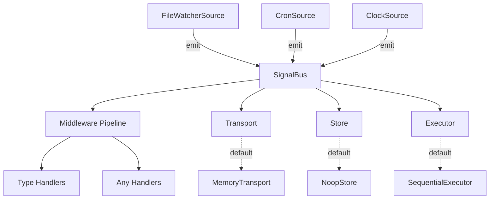

# Core Concepts

## Architecture Overview



Cadence has five core abstractions. Each is a pluggable interface with a sensible default.

## Signal

A signal is a typed event with a standard shape:

```typescript
interface BaseSignal<T extends string = string, P = unknown> {
  type: T;        // Signal type identifier
  ts: number;     // Unix timestamp (ms)
  id: string;     // Unique ID
  source?: string; // Origin identifier
  payload: P;     // Signal-specific data
}
```

You define your own signal types using `DefineSignals`:

```typescript
type MySignals = DefineSignals<{
  "file.changed": { path: string };
  "cron.fired": { jobId: string };
}>;
// Result: BaseSignal<"file.changed", { path: string }>
//       | BaseSignal<"cron.fired", { jobId: string }>
```

## Bus

The signal bus routes signals to handlers. It coordinates transport, store, and executor:

```typescript
interface SignalBus<S extends BaseSignal> {
  emit(signal: S): Promise<void>;
  on<T extends S["type"]>(type: T, handler: SignalHandler<S, T>): () => void;
  onAny(handler: AnySignalHandler<S>): () => void;
  use(middleware: Middleware<S>): void;
  clear(): void;
  stats(): BusStats;
  replay(): Promise<number>;
}
```

When you `emit()`, the bus saves to the store, dispatches through the transport, runs the middleware chain, then executes matching handlers via the executor.

## Source

Sources produce signals from external events. Every source follows the same pattern:

```typescript
interface Source<S extends BaseSignal> {
  name: string;
  start(emit: (signal: S) => Promise<void>): Promise<void>;
  stop(): Promise<void>;
}
```

Built-in sources: `createFileWatcherSource` (file changes) and `createCronSource` (schedules). The `createClockSource` adapter converts any Clock into a Source.

## Clock

Clocks are lower-level timing primitives. They tick at a rate and call a handler:

```typescript
interface Clock {
  start(handler: TickHandler): void;
  stop(): void;
  now(): number;
  stats(): TickStats;
  readonly running: boolean;
  readonly seq: number;
}
```

Three implementations:

- **IntervalClock** — Production timer with backpressure policies
- **TestClock** — Deterministic virtual time for testing
- **BridgeClock** — Adapts external heartbeats into ticks

## Pluggable Layers

Every layer has an interface and a default implementation:

| Layer | Interface | Default | Purpose |
|-------|-----------|---------|---------|
| **Transport** | `Transport<S>` | `MemoryTransport` | How signals move between emitter and subscribers |
| **Store** | `SignalStore<S>` | `NoopStore` | Persistence for durability and replay |
| **Executor** | `HandlerExecutor<S>` | `SequentialExecutor` | Controls handler concurrency |

You can swap any layer independently:

```typescript
const bus = createSignalBus<MySignals>({
  transport: createMemoryTransport(), // or your Redis transport
  store: createNoopStore(),           // or your SQLite store
  executor: createSequentialExecutor(), // or your concurrent executor
});
```

## Design Philosophy

- **Domain-agnostic** — Cadence is infrastructure. It has no concept of files, cron, or AI. Consumers define signal types and sources that make sense for their domain.
- **Build for the sophisticated case, implement simple** — Every interface supports advanced use cases (distributed transport, durable store, concurrent execution). The defaults are the simplest possible implementation.
- **Pluggable, not configurable** — Instead of options flags, swap entire implementations. This keeps interfaces small and behavior predictable.
